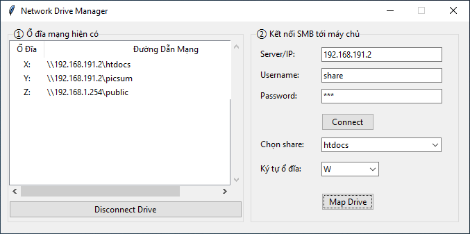

# NetworkDrive

## Giới thiệu
NetworkDrive là một ứng dụng Windows giúp người dùng quản lý các ổ đĩa mạng (SMB Network Drive) thông qua giao diện đồ họa đơn giản. Ứng dụng cho phép liệt kê, kết nối, ngắt kết nối các ổ đĩa mạng, đồng thời hỗ trợ lưu thông tin đăng nhập (credential) cho máy chủ SMB.

## Tính năng chính
- Hiển thị danh sách các ổ đĩa mạng đã kết nối.
- Ngắt kết nối ổ đĩa mạng.
- Kết nối đến máy chủ SMB bằng tài khoản riêng.
- Liệt kê các thư mục chia sẻ trên máy chủ.
- Ánh xạ (map) thư mục chia sẻ thành ổ đĩa mạng với ký tự ổ đĩa tùy chọn.
- Quản lý thông tin xác thực (credential) cho từng máy chủ.

## Yêu cầu hệ thống
- Windows 10/11 (hoặc các phiên bản Windows hỗ trợ SMB).

## Hướng dẫn sử dụng
1. **Khởi động ứng dụng**: Mở file `NetworkDrive.exe`.
2. **Quản lý ổ đĩa mạng**:
   - Xem danh sách các ổ đĩa mạng đã kết nối ở khung bên trái.
   - Chọn ổ đĩa và nhấn "Disconnect Drive" để ngắt kết nối.
3. **Kết nối đến máy chủ SMB**:
   - Nhập IP hoặc tên máy chủ, Username, Password.
   - Nhấn "Connect" để xác thực và lấy danh sách thư mục chia sẻ.
   - Chọn thư mục chia sẻ và ký tự ổ đĩa mong muốn.
   - Nhấn "Map Drive" để ánh xạ.
4. **Lưu ý**:
   - Nếu thay đổi thông tin đăng nhập cho máy chủ đã từng kết nối, bạn nên khởi động lại máy để tránh lỗi xác thực.

## Tác giả & liên hệ
- Cao Phước Danh (Kịch bản - Biên kịch - Đạo diễn)
- AI studio và ChatGPT - Diễn viên, hậu kì

---
Nếu có thắc mắc hoặc cần hỗ trợ thì kệ, Opensource viết bằng AI nên hởi AI cho nhanh :)
